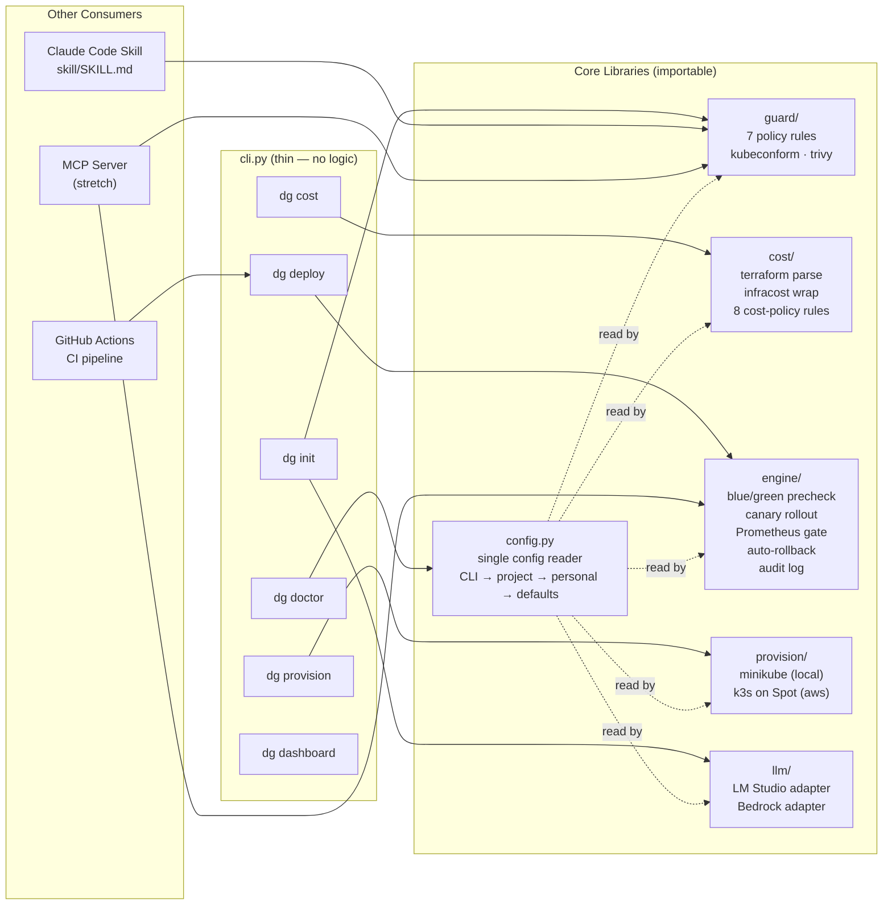
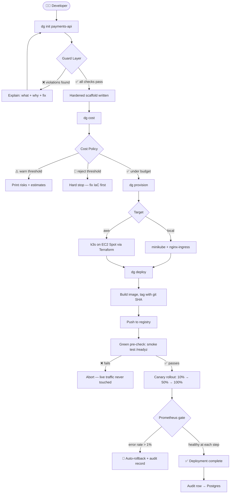
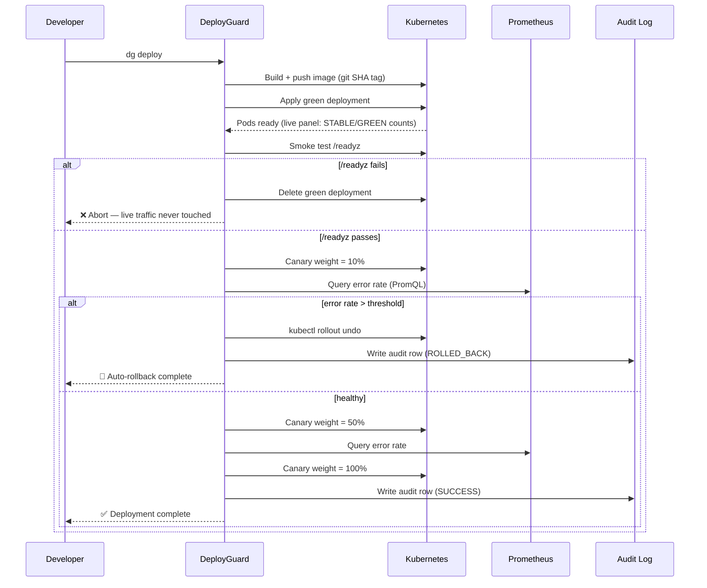
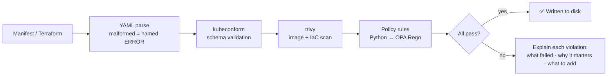

<div align="center">

# 🛡️ DeployGuard

**From `git init` to safely-deployed Kubernetes service in four commands.**

*Scaffolds hardened configs · Validates its own output · Guards your cloud bill · Deploys with automatic rollback*

[](https://www.python.org/downloads/)
[](LICENSE)
[](#testing)
[](https://typer.tiangolo.com/)
[](https://k3s.io/)
[](#cost-model)

---

```
dg init payments-api
dg cost
dg provision
dg deploy
```

*Four commands. No flags to remember. Team config in a committed file.*

</div>

---

## Contents

- [Why DeployGuard](#why-deployguard)
- [How It Works](#how-it-works)
- [Installation](#installation)
  - [1. Install prerequisites](#1-install-prerequisites)
  - [2. Install DeployGuard](#2-install-deployguard)
  - [3. Verify your setup](#3-verify-your-setup)
- [5-Minute Local Demo](#5-minute-local-demo)
- [Command Reference](#command-reference)
  - [dg doctor](#dg-doctor)
  - [dg init](#dg-init)
  - [dg cost](#dg-cost)
  - [dg provision](#dg-provision)
  - [dg deploy](#dg-deploy)
  - [dg dashboard](#dg-dashboard)
- [Configuration](#configuration)
  - [Team config (.deployguard/config.yaml)](#team-config-deployguardconfigyaml)
  - [Personal config (~/.deployguard/config.yaml)](#personal-config-deployguardconfigyaml)
  - [Service manifest (deployguard.yaml)](#service-manifest-deployguardyaml)
  - [Config priority order](#config-priority-order)
- [Cluster Cost Controls](#cluster-cost-controls)
- [AWS Deployment](#aws-deployment)
- [Standalone Claude Code Skill](#standalone-claude-code-skill)
- [Architecture](#architecture)
- [How It Works (Diagrams)](#how-it-works-diagrams)
- [Guard Layer](#guard-layer)
- [Cost Guard](#cost-guard)
- [Tech Stack](#tech-stack)
- [Testing](#testing)
- [Project Structure](#project-structure)
- [Contributing](#contributing)

---

## Why DeployGuard

Deploying a new service to Kubernetes from scratch means writing a Dockerfile, a stack of manifests, a CI pipeline, and infrastructure — each a place to get something subtly wrong:

- No resource limits → one pod starves a node and takes its neighbours down
- No readiness probes → broken pods receive live traffic
- `:latest` image tag → silent rollback to stale code
- IAM wildcard → blast radius of a compromised key is your whole account
- NAT Gateway added "temporarily" → +$32/mo forever

Today people either copy-paste from an old repo or have an LLM generate it and **ship on hope**. Almost nothing validates AI-drafted infra before it lands in production.

DeployGuard is an opinionated **paved road**: one command scaffolds a known-good stack with hardened configs, one checks what it'll cost before you spend a dollar, one provisions the cluster, and one deploys with a gradual traffic shift that **rolls back automatically if error rates spike**. It validates its own output — the generator is never trusted blindly.

> **The meta story:** DeployGuard deploys itself, the same way it deploys everything else.

---

## Installation

### Option A — One-liner (macOS + Linux)

Installs all prerequisites and `dg` in one shot:

```bash
curl -fsSL https://raw.githubusercontent.com/your-org/deployguard/main/scripts/install.sh | bash
```

The script:
- Detects your OS (macOS / Debian-Ubuntu / RHEL-Fedora)
- Installs Homebrew if missing (macOS)
- Installs all external tools: kubectl, helm, minikube, kubeconform, trivy, terraform, infracost
- Installs `dg` via `pipx` (isolated, no virtualenv management needed)
- Prints exactly what it did and what to do next

Pin a specific version:
```bash
DEPLOYGUARD_VERSION=0.1.0 curl -fsSL https://raw.githubusercontent.com/your-org/deployguard/main/scripts/install.sh | bash
```

---

### Option B — Homebrew tap (macOS, most polished)

```bash
brew tap your-org/deployguard
brew install deployguard
```

Homebrew resolves and installs every dependency automatically. After install:

```bash
brew info deployguard   # see what was installed
dg doctor               # verify
```

---

### Option C — Manual

If you prefer to manage tools yourself:

**1. Install prerequisites** (macOS with Homebrew):

```bash
# Kubernetes toolchain
brew install kubectl helm minikube

# Validation
brew install kubeconform
brew install aquasecurity/trivy/trivy

# Infrastructure + cost
brew tap hashicorp/tap && brew install hashicorp/tap/terraform
brew install infracost
```

For Docker: [Docker Desktop](https://docs.docker.com/get-docker/) or `brew install --cask docker`.

**Linux:** `dg doctor` shows exact install commands for each missing tool.

**2. Install DeployGuard:**

```bash
# Recommended — isolated install via pipx
pipx install deployguard

# Or from source
git clone https://github.com/your-org/deployguard
cd deployguard
pip install -e ".[dev]"
```

---

### Verify your setup

```bash
dg doctor
```

`dg doctor` checks every prerequisite and validates your config files. Fix anything marked `✗` before continuing. Example output:

```
Prerequisites
 ✓  Python >= 3.11   Python 3.12.3
 ✓  docker           Docker version 26.1.1
 ✓  kubectl          Client Version: v1.30.0
 ✓  helm             v3.15.0
 ✓  minikube         minikube version: v1.33.0
 ✓  kubeconform      Version: 0.6.7
 ✓  trivy            Version: 0.51.1
 ✓  terraform        Terraform v1.8.4
 ✓  infracost        Infracost v0.10.39

Config files
 ✓  project config   .deployguard/config.yaml  valid
 –  personal config  ~/.deployguard/config.yaml not found (using defaults)

✅ All prerequisites met.
```

---

## 5-Minute Local Demo

No cloud account required. Runs entirely on your machine.

```bash
# 1. Scaffold a new service (validates output before writing)
dg init payments-api

# 2. Check what it'll cost (optional but recommended)
dg cost

# 3. Bring up a local Kubernetes cluster
dg provision

# 4. Build, deploy, and watch the canary rollout
dg deploy
```

App is live. To open the Kubernetes dashboard:

```bash
dg dashboard
```

That's it. The generated service is at `http://payments-api.local` with:
- `/healthz` liveness probe
- `/readyz` readiness probe
- Resource limits on every container
- Non-root securityContext
- Pinned image tag (no `:latest`)

---

## Command Reference

### `dg doctor`

Validate your machine before doing anything else.

```bash
dg doctor
```

Checks:
- All required binaries are installed and reachable in PATH
- Python version is 3.11+
- Docker daemon is running
- Project config (`.deployguard/config.yaml`) is valid YAML with known keys
- Personal config (`~/.deployguard/config.yaml`) if present

No flags. Run it first on any new machine.

---

### `dg init`

Scaffold a hardened FastAPI+Postgres service, then validate the output before writing it.

```bash
dg init <name>
dg init payments-api          # normal usage
dg init payments-api --no-guard   # skip guard (throwaway spike only — never in CI)
```

**Emits:**

```
payments-api/
├── Dockerfile               # multi-stage, non-root, pinned base, healthcheck
├── app/
│   └── main.py              # FastAPI app with /healthz and /readyz
├── k8s/
│   ├── deployment.yaml      # probes, resource limits, securityContext, non-root
│   ├── service.yaml
│   └── ingress.yaml
├── infra/                   # Terraform stub for cloud resources
├── .github/
│   └── workflows/ci.yaml    # build → test → scan → push → deploy
├── .env.example             # referenced secrets (never real values)
├── deployguard.yaml         # per-service manifest (name, port, health endpoints)
└── README.md                # generated, with exact commands to provision + deploy
```

The guard layer runs on the generated output — if `dg init` produces a manifest that violates policy, it fails loudly and tells you why before writing anything to disk. The generator is never trusted blindly.

| Flag | Default | Description |
|---|---|---|
| `--no-guard` | off | Skip guard validation. Escape hatch for throwaway spikes. Never use in CI. |

---

### `dg cost`

Static cost report on your generated `infra/` before a single dollar is spent.

```bash
dg cost               # run from your service directory
dg cost infra/        # explicit path
dg cost --explain     # verbose reasoning per finding
```

Three sections:
1. **What will spin up** — parsed from `terraform show -json` and k8s manifests
2. **Estimated monthly cost** — running and paused figures from Infracost
3. **Bill-inflation risks** — hand-rolled cost-policy rules that editorialize about footguns

Example output:

```
📦 Resources that will spin up
  aws_instance.k3s_server     t3.small  (Spot)
  aws_db_instance.postgres    db.t3.micro
  aws_route53_record.api      (DNS only)
  kubernetes pods             2 × payments-api

💰 Estimated monthly cost
  Running:  $6.25/mo
  Paused:   $3.55/mo  (compute stopped, storage + DNS only)

⚠️  Cost policy warnings
  WARN  iam_least_privilege: IAM role uses Action: "*" — blast radius is your
        entire account. Scope to the minimum required actions.

✅ Under warn threshold ($10.00). Looks good.
```

Thresholds (`warn_threshold`, `reject_threshold`) are in your team config — not flags.

| Flag | Default | Description |
|---|---|---|
| `path` | `.` | Path to infra/ directory or Terraform root |
| `--explain` | off | Verbose reasoning per cost line |

---

### `dg provision`

Bring up a Kubernetes cluster configured for the golden path. Idempotent — safe to re-run.

```bash
dg provision                  # uses target from .deployguard/config.yaml
dg provision --target local   # override: bring up minikube
dg provision --target aws     # override: spin up k3s on EC2 Spot via Terraform
```

**Local (`target: local`):**
- Starts minikube with profile `deployguard`
- Enables ingress addon (`minikube addons enable ingress`)
- Creates namespace + resource quota
- No cloud account needed

**AWS (`target: aws`):**
- Runs Terraform in `infra/` to provision k3s on EC2 Spot
- Public subnet, no NAT Gateway, Elastic IP, security group
- Same in-cluster config as local once running
- Run `dg cost` before this — it spins up billable infrastructure

| Flag | Default | Description |
|---|---|---|
| `--target` | from config | Override config target for this run (`local` or `aws`) |

---

### `dg deploy`

Build → push → safe rollout with health checks and automatic rollback.

```bash
dg deploy                     # uses target from .deployguard/config.yaml
dg deploy --target local      # override target for this run
dg deploy --target aws        # deploy to AWS cluster
```

**What happens:**

1. Build image, tag with git SHA
2. Push to ECR (aws) or load into minikube (local)
3. Apply a green deployment, wait for pods to be ready (live Rich panel shows STABLE/GREEN counts)
4. Smoke test `/readyz` — abort before touching live traffic if it fails
5. Canary rollout: shift traffic 10% → 50% → 100% via nginx-ingress canary weights
6. Query Prometheus error rate at each step
7. If error rate exceeds threshold (default 1%): `kubectl rollout undo` and stop
8. Write audit row (who/what/when/result) to Postgres

Live traffic never sees a broken deployment.

```
● Deploying payments-api (sha: a1b2c3d)

  Pre-check
  ┌─────────────────────────────────────────────┐
  │  STABLE  2/2   GREEN  2/2   /readyz  ✓     │
  └─────────────────────────────────────────────┘

  Canary rollout
  ░░░░░░░░░░░░░░░░░░░░░  10% — error rate: 0.0% ✓
  ░░░░░░░░░░░░░░░░░░░░░  50% — error rate: 0.1% ✓
  ████████████████████  100% — error rate: 0.0% ✓

✅ Deployed. payments-api @ a1b2c3d
```

| Flag | Default | Description |
|---|---|---|
| `--target` | from config | Override config target for this run (`local` or `aws`) |

---

### `dg dashboard`

Open the minikube Kubernetes dashboard in your browser.

```bash
dg dashboard          # open browser
dg dashboard --url    # print URL only (useful in SSH sessions)
```

| Flag | Default | Description |
|---|---|---|
| `--url` | off | Print dashboard URL instead of opening browser |

---

## Configuration

### Team config (`.deployguard/config.yaml`)

Commit this. Every teammate runs the same four commands and gets identical behavior — no onboarding doc, no flag choreography.

```yaml
# .deployguard/config.yaml

guard:
  strict: true                    # true = fail on violations (use true in CI)
                                  # false = warn only (useful during rapid local dev)
  explain: true                   # include why-it-matters + what-to-add per violation
  rules:
    require_resource_limits: error   # error | warn | off
    require_probes:          error
    require_security_context: error
    no_latest_tag:           error
    no_root_user:            error
    no_privileged_containers: error
    iam_least_privilege:     warn
  custom_rules_dir: .deployguard/rules/  # drop .py or .rego rules here; auto-loaded

cost:
  currency: USD
  warn_threshold:   10.00         # warn if monthly estimate exceeds this
  reject_threshold: 50.00         # hard stop — fix IaC before provisioning
  always_explain: false           # true = verbose reasoning on every dg cost run

deploy:
  target: local                   # local | aws
  error_rate_threshold: 1.0       # % — rollback trigger
  rollout_steps: [10, 50, 100]    # traffic shift steps; tune to team's risk tolerance
  smoke_timeout: 60               # seconds to wait for /readyz before aborting
  audit: true                     # write audit rows to Postgres
```

All fields are optional — built-in defaults cover a solo dev with no config file at all.

### Personal config (`~/.deployguard/config.yaml`)

Never commit this. Machine-specific settings only — mainly which local LLM model you have pulled.

```yaml
# ~/.deployguard/config.yaml

llm:
  backend: local              # local (LM Studio) | bedrock (AWS)
  model: qwen2.5-coder:14b    # whichever model you have pulled locally
  temperature: 0.2
```

### Service manifest (`deployguard.yaml`)

Generated by `dg init`. Lives in your service root. Describes this specific service — not the tool config.

```yaml
# deployguard.yaml  (generated — edit to match your service)

name: payments-api
port: 8080
replicas: 2
health_liveness:  /healthz
health_readiness: /readyz
namespace: deployguard
```

`dg deploy` reads this file to know what to build and where to deploy it.

### Config priority order

Higher wins:

```
CLI flag              # single-run override
  ↓
project config        # .deployguard/config.yaml  — committed, shared
  ↓
personal config       # ~/.deployguard/config.yaml — local machine, not committed
  ↓
built-in defaults     # sane out-of-the-box behavior, no config required
```

**Flags are escape hatches, not the primary interface.** A flag is only justified when a single run genuinely needs to diverge from the team config.

### Custom policy rules

Drop `.py` files into `.deployguard/rules/` — they're auto-loaded by the guard engine. No code change, no fork required.

```python
# .deployguard/rules/require_team_label.py

def check(manifest: dict) -> list[dict]:
    """Require team label on all workloads."""
    labels = manifest.get("metadata", {}).get("labels", {})
    if "team" not in labels:
        return [{
            "rule": "require_team_label",
            "severity": "error",
            "message": "Missing required label 'team'.",
            "explanation": (
                "The 'team' label is required for ownership tracking and alert routing. "
                "Add metadata.labels.team: <your-team-name> to this manifest."
            ),
        }]
    return []
```

---

## Cluster Cost Controls

```bash
make up       # init + apply (bring cluster to running state)
make pause    # stop EC2 instance; keep EIP + DNS   (~$3.55/mo while paused)
make resume   # recreate instance and reattach EIP
make destroy  # tear down all AWS resources
```

`dg cost` derives cost figures from your actual Terraform — estimates stay accurate as you change infra.

---

## AWS Deployment

Set `deploy.target: aws` in `.deployguard/config.yaml`, then the same four commands work unchanged. `dg provision` runs the Terraform; `dg deploy` pushes to ECR.

**Before you start:**

```bash
# AWS credentials in environment
export AWS_ACCESS_KEY_ID=...
export AWS_SECRET_ACCESS_KEY=...
export AWS_DEFAULT_REGION=us-east-1

# Check prerequisites
dg doctor

# Review what it'll cost before spinning anything up
dg cost

# Then the same four commands
dg init payments-api
dg provision          # spins up k3s on EC2 Spot — billable from here
dg deploy
```

Running cost: ~$6.25/mo (EC2 Spot + RDS micro + Route 53, no NAT Gateway).

---

## Standalone Claude Code Skill

The guard layer ships as a standalone Claude Code skill. No cluster, no AWS, no `dg` install — just drop one file.

```bash
# Add to any project's Claude skills directory
mkdir -p .claude/skills/deployguard-guard
cp /path/to/deployguard/skill/SKILL.md .claude/skills/deployguard-guard/SKILL.md
```

Then in Claude Code:

```
/guard k8s/deployment.yaml
/guard infra/main.tf
/guard k8s/
```

Runs kubeconform schema validation, trivy image scan, and all 7 policy rules. Each violation explains what failed, why it matters, and exactly what to add.

**Primary use case:** paste an LLM-generated manifest and get a senior reviewer's assessment, not just a linter.

---

## Architecture



**Architecture rule:** `guard/`, `cost/`, and `engine/` are libraries, not scripts. The CLI, the Claude Code skill, and a future MCP server all import the same modules. Core logic never lives inside CLI handlers.

---

## How It Works (Diagrams)

### Full pipeline



### Rollout sequence



---

## Guard Layer



| Rule | Severity | Why it matters |
|---|---|---|
| `require_resource_limits` | error | One pod can starve a node and take neighbors down |
| `require_probes` | error | Broken pods receive live traffic without readiness probes |
| `require_security_context` | error | Missing non-root + read-only root filesystem |
| `no_latest_tag` | error | Silent rollback to stale code on node restart |
| `no_root_user` | error | Container escape → host root |
| `no_privileged_containers` | error | Privileged = host kernel access |
| `iam_least_privilege` | warn | IAM wildcard = full account blast radius |

Every violation explains itself:

```
✗ require_resource_limits
  Without resource limits, one misbehaving pod can consume all CPU and memory
  on its node, causing an OOM kill cascade that takes other services down with it.
  Add resources.requests and resources.limits to every container spec.
```

---

## Cost Guard

| Rule | Default | Description |
|---|---|---|
| NAT Gateway present | reject | +$32/mo + data processing fees |
| On-demand instead of Spot | warn | 3–5× cost premium |
| Oversized instance | warn | Relative to golden-path baseline |
| Load balancer (ALB/NLB) | warn | +$16+/mo each |
| Uncapped RDS autoscaling | warn | Silent bill inflation |
| `count`/`for_each` on billable resource | warn | Multiplier on standing cost |
| Standing resource, no pause path | reject | Must have `make pause` or `make destroy` |
| Unattached Elastic IP | warn | Small but avoidable |

---

## Cost Model

| State | Est. monthly | Notes |
|---|---|---|
| Running | ~$6.25 | EC2 Spot + RDS micro + Route 53; no NAT Gateway |
| Paused | ~$3.55 | Compute stopped; storage + DNS only |
| Local | $0 | minikube on your machine |

---

## Tech Stack

| Concern | Choice | Why |
|---|---|---|
| CLI | Python + Typer | Clean, testable, Python-native |
| Config / schemas | Pydantic | Typed, validated config for free |
| Terminal UX | Rich | Live rollout panel — half the demo |
| Templating | Jinja2 | Standard, transparent output |
| Manifest validation | kubeconform + trivy + Python policy | Deterministic guard layer |
| Cost estimation | Infracost JSON + `terraform show -json` | Accurate pricing — wrapped, not reinvented |
| Deploy engine | Python module + `kubernetes` client | Reusable by CLI, skill, and MCP server |
| Metrics | Prometheus HTTP API (PromQL) | Rollout watches error rate per step |
| Audit | SQLAlchemy → Postgres | Persisted audit trail |
| Local cluster | minikube + ingress addon | Simpler than Helm ingress-nginx on local |
| Prod cluster | k3s on EC2 Spot, no NAT Gateway | ~$3–5/mo |
| Registry | ECR | Already in the AWS toolchain |
| CI/CD | GitHub Actions | `dg deploy` called from the pipeline |
| LLM (stretch) | LM Studio (local) or AWS Bedrock | Switchable by one config line |

---

## Milestone Status

| Milestone | Status | Description |
|---|---|---|
| M-1 Guard skill | ✅ Done | Standalone module + SKILL.md |
| M0 Spine | ✅ Done | init → provision → deploy end-to-end |
| M1 Harden + cost | ✅ Done | Hardened templates, guard in init, dg cost, full config |
| M2 Deploy engine | ✅ Done | Gradual rollout, Prometheus gate, auto-rollback, audit |
| M3 AWS + self-deploy | ✅ Done | ECR, k3s on Spot, GitHub Actions CI, self-deploy |
| M4 LLM + MCP | 🚧 In progress | LM Studio adapter working; Bedrock + MCP server pending |

---

## Testing

```bash
pip install -e ".[dev]"

pytest                              # full suite
pytest tests/test_guard.py          # guard + policy unit tests (asserts on explanation text)
pytest tests/test_smoke_e2e.py      # spine test — must always pass
pytest tests/test_cost.py           # cost policy rules
pytest tests/test_config.py         # config priority order + schema validation
pytest -m "not integration"         # skip tests that require a running cluster
```

`test_smoke_e2e.py` is the branch-protection gate. No merge breaks the spine.

---

## Project Structure

```
deployguard/
├── cli.py               # Typer entrypoint — thin; no logic lives here
├── config.py            # single config reader — every module reads through this
├── guard/               # kubeconform + trivy + 7 policy rules with explanations
├── cost/                # terraform parse + infracost + 8 cost-policy rules
├── engine/              # blue/green precheck · canary rollout · rollback · audit
├── provision/           # minikube (local) and k3s on Spot (aws)
├── llm/                 # thin adapter: LM Studio local or AWS Bedrock
└── scaffold/            # Jinja2 templates for the golden path
skill/
└── SKILL.md             # standalone Claude skill — wraps guard/
infra/                   # Terraform: k3s on EC2 Spot (no NAT Gateway)
tests/
├── test_guard.py        # feeds bad manifests, asserts rejection + explanation text
├── test_cost.py         # feeds footgun Terraform, asserts risk flagged
├── test_config.py       # priority order, schema validation, custom rules
└── test_smoke_e2e.py    # spine test — must always pass
```

---

## Contributing

1. Lock contracts first — `deployguard.yaml` Pydantic schema, config schema, `dg init` output shape.
2. `test_smoke_e2e.py` is the branch-protection gate — never merge red.
3. Core logic stays in libraries (`guard/`, `cost/`, `engine/`) — not in CLI handlers.
4. Conventional commits, one vertical slice per PR, cross-lane review.
5. Flags are escape hatches — if it can live in config, it goes in config.

---

## Non-Goals

Explicitly out of scope. If they come up: flag and stop.

- Web UI or Backstage portal
- Multi-cluster, multi-tenant, RBAC, org-level policy
- EKS or any managed Kubernetes
- Second golden path (non-FastAPI)
- General FinOps platform
- SaaS features

---

## License

MIT

---

<div align="center">

**DeployGuard deploys itself — the same way it deploys everything else.**

[Quick Start](#5-minute-local-demo) · [Command Reference](#command-reference) · [Skill](skill/SKILL.md) · [PRD](PRD.md) · [Issues](../../issues)

</div>
